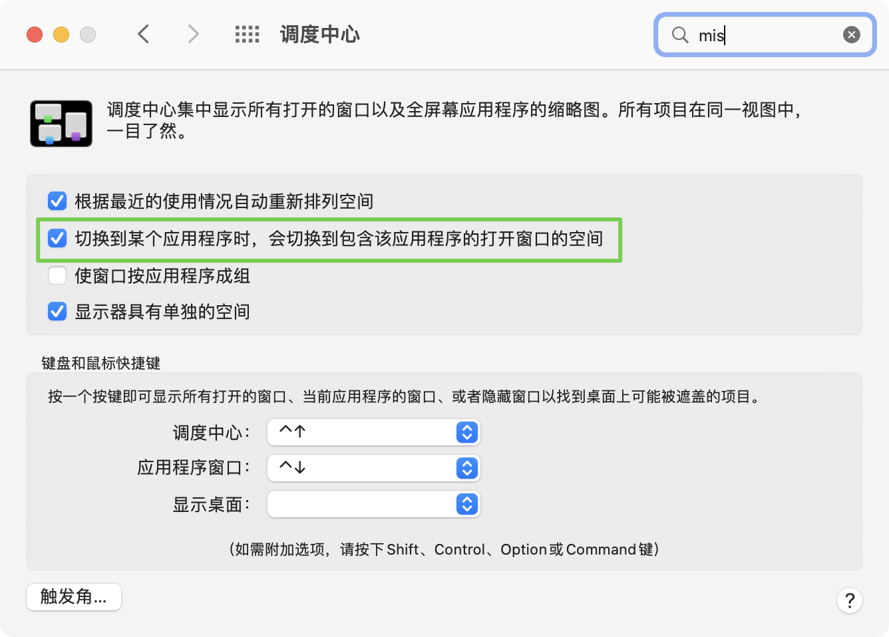
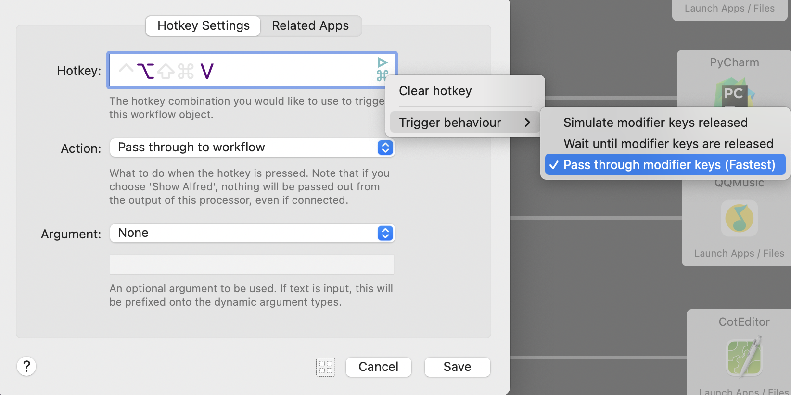
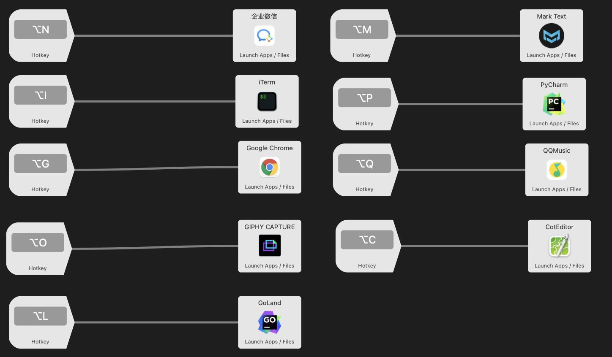

# app-switch-flow

Quickly switch app window using alfred.

## Best practices

If you won't get more, you can simply download [Manico](https://apps.apple.com/us/app/manico/id724472954?mt=12) and pay for it.

1. Full screen or not when you open a new application, I recommand you to full it for more clear.

2. Select second option, it's helpful.
   
   

3. Add a  alfred workflow via below steps.
   
   1. Add a `hotkey` trigger, ensuring the following options:
      
      
      
      1. Select your hotkey.
      
      2. Select `trigger behaviour ` as `Pass Through ...` which is a fast mode.
      
      3. Action Option is `Pass Through to workflow`.
      
      4. Argument is None.
   
   2. Add a `Launch Apps/Files` Action, ensuring the following options:
      
      1. Drop a app which you want to open from `Applications Finder`.
   
   3. Try your hot key to trigger the app.
   
   4. Repeat above steps, finish all app configs.

## Installion

Here I provide a [personal version](https://github.com/o98k-ok/app-switch-flow/releases) for this flow, you can edit/del it for using.

Also the apps is very hansome, you can try it.
